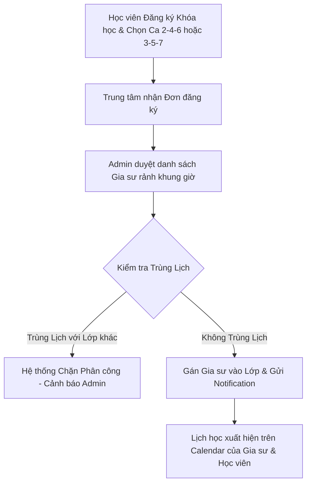

# Business Rule 03: Course Scheduling, Conflict Validation & Center Assignment

## 1. Quy tắc Khởi tạo Lịch Học & Ca Học (Course Schedule & Shifts)

### 1.1. Cấu hình Ca Học (Class Shifts)
Mỗi Khóa học do Trung tâm tạo ra sẽ chia thành các **Ca học định kỳ** theo lịch hàng tuần:
- **Tần suất phổ biến**: 
  - Lịch Thứ 2 - Thứ 4 - Thứ 6 (`MON_WED_FRI`).
  - Lịch Thứ 3 - Thứ 5 - Thứ 7 (`TUE_THU_SAT`).
  - Lịch Cuối tuần Thứ 7 - Chủ nhật (`SAT_SUN`).
- **Khung ca học (Time Slots)**: Ca sáng (08:00 - 10:00), Ca chiều (14:00 - 16:00), Ca tối (18:00 - 20:00, 19:30 - 21:30).

---

## 2. Quy trình Trung Tâm Phân Công Gia Sư & Bắt Trùng Lịch (Assignment & Conflict Validation)

### 2.1. Quy tắc Validation Bắt Trùng Lịch (Hard Conflict Validation)
Khi Admin Trung tâm chọn một Gia sư để phân công vào Ca học của một Lớp:
1. Hệ thống tự động kiểm tra lịch dạy của Gia sư đó trên toàn bộ các Khóa học đang diễn ra.
2. **Nếu Gia sư đã có lịch dạy trùng bất kỳ ca học nào** (dù chỉ trùng 15 phút):
   - Hệ thống **KHÔNG CHO PHÉP GÁN GIA SƯ**.
   - Hiển thị thông báo lỗi: *"Gia sư [Tên Gia sư] đã có ca dạy Lớp [Mã Lớp] từ [HH:mm] đến [HH:mm] vào ngày Thứ [X]. Vui lòng chọn Gia sư khác!"*

---

## 3. Quy trình Dời Lịch / Xin Nghỉ Buổi Học (Reschedule & Subbed Tutor Workflow)

### 3.1. Quy định Xin Nghỉ từ Gia Sư hoặc Học Viên
- **Xin nghỉ trước $\ge 24$ giờ**: Buổi học được đưa vào trạng thái `PENDING_RESCHEDULE`.
- **Nghỉ do Gia sư**: Admin Trung tâm có 2 phương án xử lý:
  1. **Phương án 1 (Học bù)**: Admin xếp một ca học bù (Make-up Slot) vào ngày rảnh của cả Gia sư và Học viên.
  2. **Phương án 2 (Gia sư dạy thay)**: Admin phân công một Gia sư Trung tâm khác rảnh ca đó đến dạy thay (đối với Lớp Online hoặc Offline tại Trung tâm).
