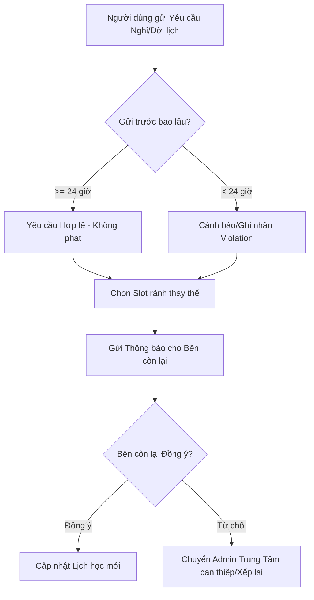

# Business Rule 03: Scheduling, Conflict Validation & Reschedule Workflow

## 1. Cơ chế Quản lý Lịch Rảnh & Đăng Bài (Schedule & Post Creation)

### 1.1. Cấu trúc Lịch Rảnh (Time Slot Structure)
Hệ thống chia thời gian theo Slot 30 phút hoặc 2 tiếng chuẩn:
- Một `TimeSlot` gồm: `{ DayOfWeek (2..8), StartTime (HH:mm), EndTime (HH:mm), SpecificDate (YYYY-MM-DD) }`.
- Gia sư quản lý **Lịch rảnh cố định hàng tuần (Weekly Availability)** và **Lịch rảnh ngoại lệ (Exception Dates)**.

---

## 2. Quy tắc Validation Chống Trùng Lịch (Schedule Conflict Validation Rules)

Để đảm bảo tính khả thi của lớp học, hệ thống **bắt buộc kiểm tra Validation trùng lịch (Hard Conflict Validation)** tại 2 mốc thời gian:

1. **Khi Gia sư / Học viên Đăng Bài Post tìm lớp / mở lớp**.
2. **Khi Trung tâm hoặc Học viên Xác Nhận Xếp Lịch (Booking Match)**.

### 2.1. Điều kiện Validation Trùng Lịch (Conflict Condition)
Một mốc thời gian đăng ký $S_{\text{new}} = [T_{\text{start1}}, T_{\text{end1}}]$ bị coi là **TRÙNG LỊCH (CONFLICT)** với một mốc đã tồn tại $S_{\text{existing}} = [T_{\text{start2}}, T_{\text{end2}}]$ trên cùng một ngày $D$ nếu và chỉ nếu:

$$\max(T_{\text{start1}}, T_{\text{start2}}) < \min(T_{\text{end1}}, T_{\text{end2}})$$

### 2.2. Xử lý Validation (Business Rules System Behavior):
- **Trường hợp Gia sư đăng Post mở lớp / đăng lịch rảnh**:
  - Hệ thống truy vấn toàn bộ các Lớp học đang hoạt động (`ACTIVE_CLASS`), Các buổi hẹn đã confirm (`BOOKED_SESSION`) của Gia sư đó.
  - **Nếu trùng $\ge 1$ phút**: Hệ thống **NGĂN KHÔNG CHO ĐĂNG POST**, trả về thông báo lỗi:
    > *"Lỗi trùng lịch: Bạn đã có lịch dạy từ [HH:mm] đến [HH:mm] ngày [DD/MM/YYYY]. Vui lòng chọn khung giờ khác."*
- **Trường hợp Học viên tạo Post yêu cầu Gia sư chỉ định**:
  - Hệ thống kiểm tra lịch của Gia sư được chỉ định. Nếu trùng lịch $\to$ Cảnh báo Học viên và gợi ý dời khung giờ hoặc recommend Gia sư khác thuộc Trung tâm.

---

## 3. Quy trình Dời Lịch / Xin Nghỉ (Reschedule Workflow)

Trong quá trình học, nếu Gia sư hoặc Học viên có việc đột xuất cần nghỉ, hệ thống xử lý theo Quy tắc Dời Lịch (Reschedule Business Rule):

### 3.1. Quy định Thời gian Báo Trước (Notice Period)
1. **Báo trước $\ge 24$ tiếng**: Buổi học được chuyển sang trạng thái `PENDING_RESCHEDULE`. Không tính phí phạt đối với bất kỳ bên nào.
2. **Báo trước $< 24$ tiếng (Nghỉ gấp)**:
   - **Nếu do Gia sư nghỉ gấp**: Gia sư phải đền bù bù buổi dạy hoặc bị trừ điểm uy tín (Rating/Reliability Score).
   - **Nếu do Học viên nghỉ gấp**: Buổi học đó vẫn có thể tính là đã dạy (trừ khi Gia sư châm chước đồng ý dời).

### 3.2. Vai trò Trung Tâm Xếp Lịch Can Thiệp (Admin Intervention)
- Nếu sau 48h hai bên không thỏa thuận được lịch học bù mới, **Admin Trung tâm sẽ nhận ticket hỗ trợ**.
- Admin có quyền:
  - Thay đổi thời gian buổi học thủ công trên hệ thống.
  - Phân công Gia sư thuộc Hệ thống khác dạy thay (nếu là Lớp do Trung tâm quản lý).
  - Hoàn lại credit/buổi học cho Học viên nếu lỗi từ Gia sư.
