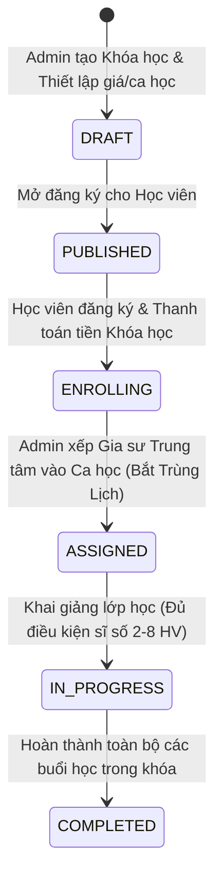

# Business Rule 04: Class Management & Video Call Roadmap

## 1. Vòng Đời Lớp Học & Khóa Học (Course & Class Lifecycle)

---

## 2. Quy tắc Lớp Học Online vs Offline (Online & Offline Attendance)

- **Lớp Offline (Tại Trung tâm / Tại nhà)**: Điểm danh qua mã QR hoặc Gia sư xác nhận Check-in trên ứng dụng.
- **Lớp Online**: Học viên và Gia sư tham gia phòng Video Call được tích hợp sẵn trong ứng dụng VietTriTutor. Hệ thống tự động điểm danh khi thời gian tham gia phòng $\ge 70\%$ thời lượng ca học.

---

## 3. Lộ Trình Kỹ Thuật Video Call (Video Call Roadmap)

- **Giai đoạn 1 (MVP)**: Sử dụng SDK bên thứ 3 (Agora.io, Jitsi Meet API, Zoom SDK, Daily.co) để tích hợp nhanh tính năng phòng học ảo (Video/Audio, Screen Share, Chat).
- **Giai đoạn 2 (Nâng cao)**: Tự phát triển Media Server riêng (sử dụng Mediasoup SFU WebRTC) kết hợp Bảng trắng tương tác (Interactive Whiteboard) và Cloud Recording để lưu bài giảng cho học viên xem lại.
