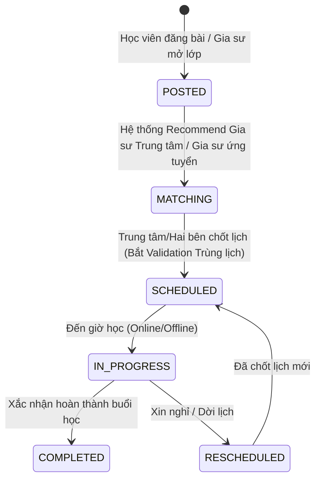
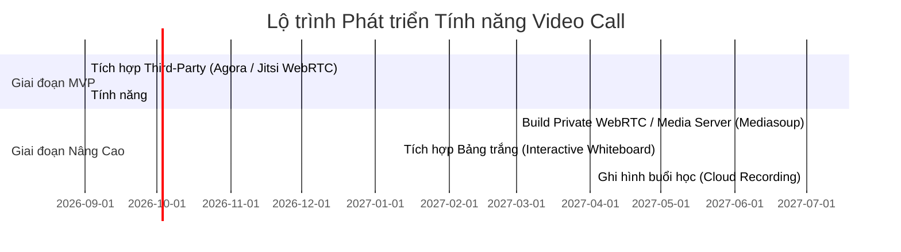

# Business Rule 04: Matching, Class Management & Video Call Roadmap

## 1. Quy trình Kết Nối & Quản Lý Lớp Học (Class Lifecycle & Matching Workflow)

### 1.1. Vai trò Xếp lịch của Trung Tâm Gia Sư (Admin Scheduling Center)
- **Lớp Tự Do**: Gia sư và Học viên tự chọn khung giờ khớp nhau, hệ thống tự động kiểm tra Validation và chuyển trạng thái `SCHEDULED`.
- **Lớp Trung Tâm Xếp (Center-Assigned Class)**: 
  - Áp dụng cho các Học viên gửi yêu cầu trực tiếp cho Trung tâm ("Nhờ Trung tâm tìm & xếp gia sư").
  - Admin Trung tâm sử dụng Dashboard Xếp Lịch để gán Gia sư Hệ thống (`OFFICIAL_TUTOR`) phù hợp vào lớp.
  - Admin có quyền đè lịch (Override) hoặc điều chỉnh lịch học linh hoạt khi có sự cố phát sinh.

---

## 2. Quy tắc Lớp Học Online vs Offline (Online & Offline Rules)

| Tiêu chí | Lớp Offline | Lớp Online |
| :--- | :--- | :--- |
| **Địa điểm / Kết nối** | Địa chỉ nhà Học viên hoặc Trung tâm gia sư. | Phòng học ảo trên ứng dụng VietTriTutor. |
| **Điểm danh (Check-in)** | Gia sư ấn "Check-in" bằng GPS địa điểm hoặc Học viên xác nhận OTP/mã QR tại chỗ. | Hệ thống tự động điểm danh khi cả 2 tham gia phòng Video Call $\ge 15$ phút. |
| **Yêu cầu Kỹ thuật** | Không | Tích hợp giải pháp Video Call. |

---

## 3. Lộ Trình Phát Triển Tính Năng Video Call (Video Call Technology Roadmap)

Định hướng hạ tầng công nghệ học Online phục vụ giảng dạy từ MVP tới Hệ thống Tự Build hoàn chỉnh:

### 3.1. Giai đoạn MVP: Tích hợp Third-Party Video Call
- **Giải pháp**: Sử dụng API/SDK của bên thứ ba như **Agora.io**, **Jitsi Meet API**, **Daily.co** hoặc **Zoom SDK**.
- **Ưu điểm**:
  - Triển khai cực nhanh, chi phí đầu tư ban đầu thấp.
  - Độ ổn định kết nối cao, hỗ trợ đa nền tảng (Web, Mobile App).
- **Tính năng cốt lõi MVP**:
  - Phòng học bảo mật (Room Token tự tạo theo ID buổi học).
  - Bật/Tắt Mic, Camera.
  - Chia sẻ màn hình (Screen Sharing) giảng dạy.
  - Chat trong phòng học.

### 3.2. Giai đoạn Nâng Cao: Tự Build Hệ Thống Video Call (Self-Hosted Media Infrastructure)
- **Giải pháp**: Tự xây dựng Server truyền thông riêng dựa trên SFU (Selective Forwarding Unit) như **Mediasoup**, **Janus WebRTC**, hoặc **LiveKit**.
- **Lý do nâng cao**:
  - Tối ưu hóa chi phí khi lượng người dùng bùng nổ (không phụ thuộc theo phút của bên thứ 3).
  - Làm chủ dữ liệu học tập và bảo mật thông tin.
- **Tính năng Nâng cao**:
  - **Interactive Whiteboard (Bảng trắng tương tác)**: Gia sư và học viên cùng vẽ, viết công thức toán/lý/hóa trực tiếp.
  - **Cloud Recording**: Tự động ghi âm/ghi hình lưu trữ trên S3/Cloud Storage để học viên xem lại bài giảng.
  - **AI Tutor Assistant**: Phân tích cảm xúc, mức độ tập trung của học viên trong buổi học Online.
